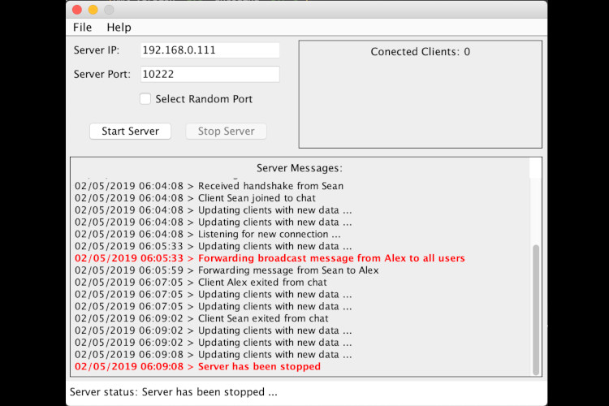

# networked-chat
Networked Chat with RSA Encryption/Decryption

This was a group project, and [Sean Martinelli](https://github.com/SeanMartinelli) was equaly involved in development of this application.

The purpose of this project is to allow users to send encrypted messages to each other over the network. This project is targeted at anyone that would like to send private messages over a network to other users. Two separate programs are required to make this work, the server and the client programs.  
The purpose of the server is to coordinate interactions between all of the users that are connected to it. It does this by managing each user’s connection, relaying messages between clients, and broadcasting certain messages to all users. Ther server is also responsible for storing and distributing the public keys of all of the users.  
The purpose of the client program is to allow users to connect to the server and send encrypted messages to other users. Users must connect to a server before sending messages. They will only be able to send messages to other users also connected to that server.

### IMPORTANT information about primeNumbers.rsc file:
- This program uses an RSA block size of 8 so the primeNumbers.rsc file must contain at least one combination of two prime numbers that has a product greater than: 72,057,594,037,927,936
- In the case of this error message "primeNumbers.rsc cannot be found.", make sure the NewtworkedChatClient folder is the working directory for the client program.